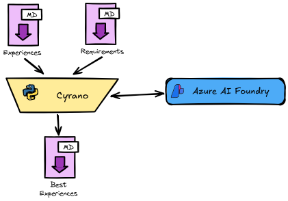

# Cyrano

Cyrano de Bergerac, the titular character in Edmond Rostand's play, is a masterful wordsmith renowned for his eloquence, wit, and ability to craft beautiful and persuasive texts. His dedication to his craft is evident in his meticulous attention to detail.

Were he alive today, Cyrano would undoubtedly harness the power of AI to craft compelling résumés.

## Overview

The tooling is written in Python and leverages the Azure AI Foundry offering.

Here are a couple of links to get you started:

* [Installation and configuration](/docs/installation.md)
* Some [recipes](/docs/recipes.md)
